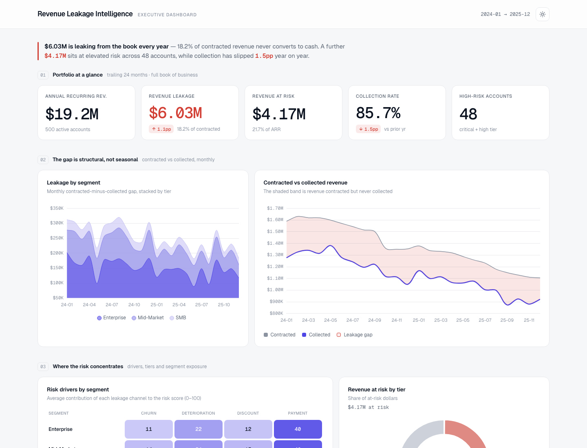

# Revenue Leakage Intelligence

Python analytics pipeline that quantifies B2B SaaS revenue leakage from discounting, collection failures, account deterioration, and silent churn signals.

[**Open the live executive dashboard**](https://mfidalgomartins.github.io/revenue-leakage-intelligence/) · [Methodology](docs/methodology.md)

[](https://github.com/mfidalgomartins/revenue-leakage-intelligence/actions/workflows/ci.yml)



## Decision Output

The reproducible synthetic scenario contains 500 B2B SaaS customers and 24 monthly periods from January 2024 to December 2025.

| Metric | Result |
|---|---:|
| Annual recurring revenue | $19.2M |
| Contracted revenue, 24 months | $33.1M |
| Total revenue leakage | $6.0M (18.2% of contracted revenue) |
| Collection failures | $4.5M |
| Discount leakage | $1.5M |
| Revenue at risk | $4.2M (21.7% of ARR) |
| Critical and high-risk accounts | 48 |
| Top 10% customer concentration | 43.9% of revenue |

Payment failures contribute 44% of the weighted risk score. The top 20 accounts represent approximately 25% of revenue at risk, making account-level intervention more valuable than a broad retention campaign.

## What It Does

- Generates deterministic synthetic customer, billing, collection, engagement, and product-usage data.
- Reconciles contracted, billed, and collected revenue.
- Scores silent churn, deterioration, discount, and payment risk at customer level.
- Produces a prioritized account scorecard, seven analytical charts, validation reports, and an interactive executive dashboard.
- Runs 19 automated data-quality and analytical-integrity checks.

## Run Locally

Requires Python 3.10 or newer.

```bash
git clone https://github.com/mfidalgomartins/revenue-leakage-intelligence.git
cd revenue-leakage-intelligence

python3 -m venv .venv
source .venv/bin/activate
python -m pip install --upgrade pip
python -m pip install -r requirements.txt

python scripts/run_pipeline.py
python -m pytest -q
```

Open `dashboard/executive_dashboard.html` after the pipeline completes:

```bash
open dashboard/executive_dashboard.html  # macOS
```

Generated source data, processed tables, charts, and reports are intentionally ignored by Git. The tracked dashboard is the public demonstration artifact.

## Analytical Design

| Risk dimension | Weight | Signal |
|---|---:|---|
| Silent churn | 30% | Recent engagement slope and low absolute engagement |
| Gradual deterioration | 25% | First-half versus second-half MRR and smoothed trend |
| Discount anomalies | 20% | Discount frequency, magnitude, and rep-level impact |
| Payment anomalies | 25% | Collection rate, failed payments, and partial payments |

The composite score prioritizes investigation; it is not a causal estimate or a calibrated probability of churn. See [docs/methodology.md](docs/methodology.md) for formulas, validation rules, and limitations.

## Repository Structure

```text
dashboard/
  executive_dashboard.html    # Tracked public dashboard
docs/
  methodology.md              # Analytical definitions and limitations
notebooks/
  analysis.ipynb              # Reproducible exploratory workflow
scripts/
  run_pipeline.py             # End-to-end generation, analysis, and validation
  explore_data.py             # Detailed data-quality exploration
  run_analysis.py             # Decision-oriented analytical report
  redesign_dashboard.py       # Shared publication dashboard template
src/
  build_executive_dashboard.py
  data_generator.py
  data_profiler.py
  leakage_analyzer.py
  runtime.py
  validators.py
  visualizations.py
tests/
  test_data_generator.py
  test_leakage_analyzer.py
```

## Scope And Limitations

- Data is synthetic and contains deliberately embedded leakage patterns.
- Risk weights are judgment-based and require calibration before operational use.
- Scores indicate prioritization signals, not causation or forecast probabilities.
- The model excludes external market, support, contract, and CRM signals.
- The dashboard loads Chart.js and Geist fonts from jsDelivr, so interactive rendering requires internet access.

## License

Released under the [MIT License](LICENSE).
